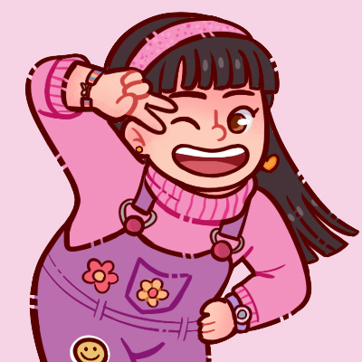

<h2 align="left">Hi 👋! My name is Isabelle Mosca and I'm a student from Data Analytics</h2>

###

  
  

###

###

  
  
  
  
  
    
  
  
  

###

  <a href="https://www.instagram.com/bellemoscarts/">
  <a href="https://discord.com/channels/@bellemosca#7307">
  <a href="mailto:bellemosca@gmail.com">
  <a href="https://www.linkedin.com/in/isabelle-mosca-390975108/">

###

 

###
